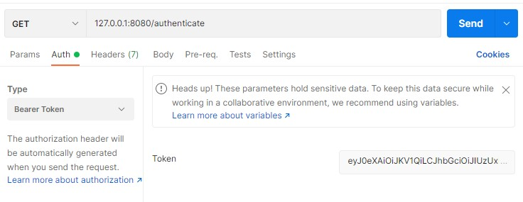

## 6. auth token
> jwt를 이용한 인증방법  

[참고링크](https://github.com/imran4u/ktor-jwt-example)

1. gradle 설정

jwt외에도 부가적으로 필요한 라이브러리를 추가한다. 
~~~
implementation "io.ktor:ktor-auth:$ktor_version"
implementation "io.ktor:ktor-auth-jwt:$ktor_version"
implementation "io.ktor:ktor-server-sessions:$ktor_version"
~~~

2. jwt를 관리할 클래스를 만든다. 

~~~kotlin
import com.auth0.jwt.JWT
import com.auth0.jwt.JWTVerifier
import com.auth0.jwt.algorithms.Algorithm
import io.ktor.auth.Principal
import java.util.*

// session을 위한 data 클래스 
// import io.ktor.auth.Principal 임을 반드시 채크
data class Account(
    var name: String,
    var passwd : String ) : Principal

// jwt(json web token)은
// 해더(header).내용(payload).서명(signature) 구조로 되어있다.

object JwtHelper {
    private const val secret = "7y3yfdshjkfhjkds7682dAAeecde" // 검증을 위한 알고리즘 secret 값
    const val issuer = "com.psw"                              // issuer(토큰발급자)
    private const val validTime = 36_000_00 * 24              // 토큰유효 기간
    private val algorithm = Algorithm.HMAC512(secret)         // 알고리즘

    val verifier: JWTVerifier = JWT
        .require(algorithm)
        .withIssuer(issuer)
        .build()

    fun buildToken(user: Account): String = JWT.create()
        .withSubject("Authentication")
        .withIssuer(issuer)
        .withClaim("name", user.name)
        .withClaim("password", user.passwd)
        .withExpiresAt(getExpTime())
        .sign(algorithm)

    private fun getExpTime() = Date(System.currentTimeMillis() + validTime)

}

~~~

3. plugin을 install 한다. 
   
verifier에 JwtHelper에 정의해놓은 JWTVerifier값을 대입한다. 그리고 realm에는 토큰발급자 정보를 대입한다. validate에서는 JWTToken에 저장된 값을 Authentication의 세션정보에 저장한다. 
~~~kotlin
install(Authentication) {
    jwt {
        verifier(JwtHelper.verifier)
        realm = JwtHelper.issuer
        validate {
            val name = it.payload.getClaim("name").asString()
            val password = it.payload.getClaim("password").asString()
            if(name != null && password != null){
                Account(name, password )
            }else{
                null
            }
        }
    }
}

~~~

4. JWTToken을 생성하고 HTTP Auth header에서 대입시켜 통신한다.
   
JwtHelper.buildToken()에 Principal로 상속된 dataclass를 넘긴다. 클라이언트에서는 http header의 Authorization 영역(Authorization: Bearer 토큰)에서 대입시켜 통신한다. 
그리고 JWT Token의 payload에 저장된 값을 가지고 오고자 한다면 Principal로 상속하여 정의했던 클래스를 call.principal<데이터형>()으로 가져오면 된다. 
~~~kotlin

private fun Routing.authRouting(){
    post("/generate_token"){
        val user = call.receive<Account>()
        print("${user.name} , pwd= ${user.passwd}")
        val token = JwtHelper.buildToken(user)
        call.respond(token)

    }

    authenticate{
        get("/authenticate"){
            val account = call.principal<Account>()
            call.respond("get authenticated value from token " +
                    "name = ${account?.name}, password= ${account?.passwd}")
        }
    }
}

~~~

