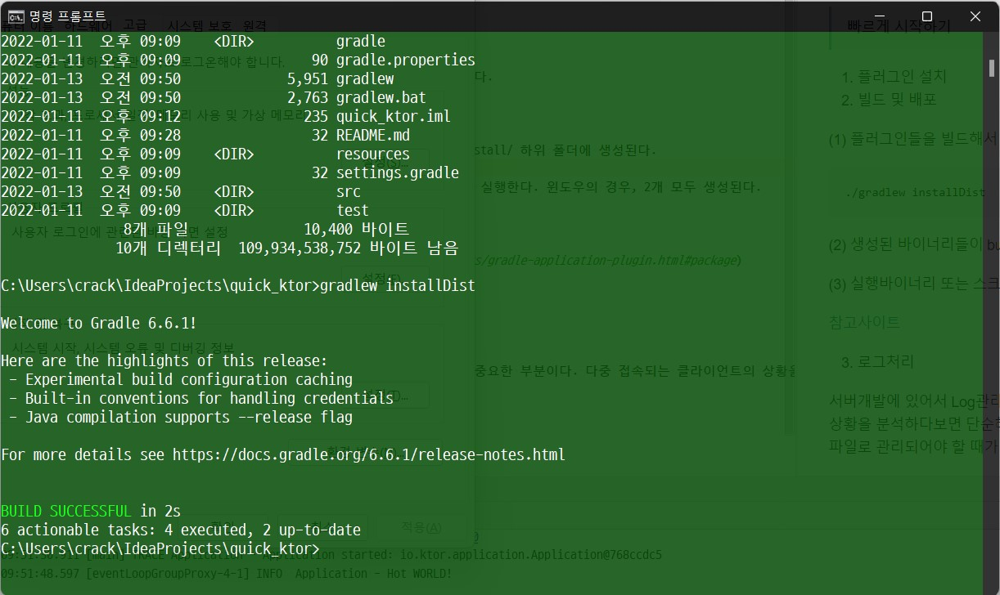

#### 1. QuickStart
> 빠르게 시작하기 

1. 플러그인 설치

intelliJ에서 ktor관련 플러그인을 설치한다.

2. 빌드 및 배포

(1) 플러그인들을 빌드해서 배포한다.
~~~
./gradlew installDist
~~~

(2) 생성된 바이너리들이 build/install/ 하위 폴더에 생성된다.

(3) 실행바이너리 또는 스크립트를 실행한다. 윈도우의 경우, 2개 모두 생성된다.

[참고사이트](https://ktor.io/docs/gradle-application-plugin.html#package)

   

3. 로그처리 

서버개발에 있어서 Log관리는 무척중요한 부분이다. 다중 접속되는 클라이언트의 상황을 분석하다보면 단순히 메시지만 처리하는 것으로 끝나지 않고 데이터화하여 파일로 관리되어야 할 때가 많기 때문이다.

[콘솔출력]
~~~
<configuration>
    <appender name="STDOUT" class="ch.qos.logback.core.ConsoleAppender">
        <encoder>
            <pattern>%d{YYYY-MM-dd HH:mm:ss.SSS} [%thread] %-5level %logger{36} - %msg%n</pattern>
        </encoder>
    </appender>
    <root level="trace">
        <appender-ref ref="STDOUT"/>
    </root>
    <logger name="io.netty" level="INFO"/>
</configuration>
~~~

[파일출력]
~~~
<configuration>
    <appender name="FILE" class="ch.qos.logback.core.FileAppender">
        <file>testFile.log</file>
        <append>true</append>
        <encoder>
            <pattern>%d{YYYY-MM-dd HH:mm:ss.SSS} [%thread] %-5level %logger{36} - %msg%n</pattern>
        </encoder>
    </appender>
    <root level="trace">
        <appender-ref ref="FILE"/>
    </root>
    <logger name="io.netty" level="INFO"/>
</configuration>
~~~

- [Logback 참고사이트](https://logback.qos.ch/manual/configuration.html)
- [Logger  참고사이트](https://ktor.io/docs/logging.html#configure-logback)