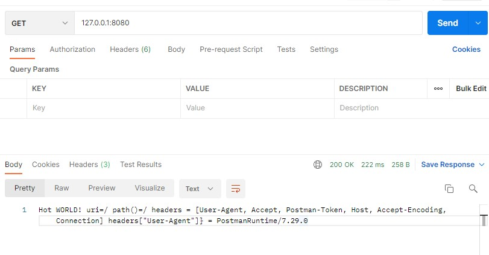
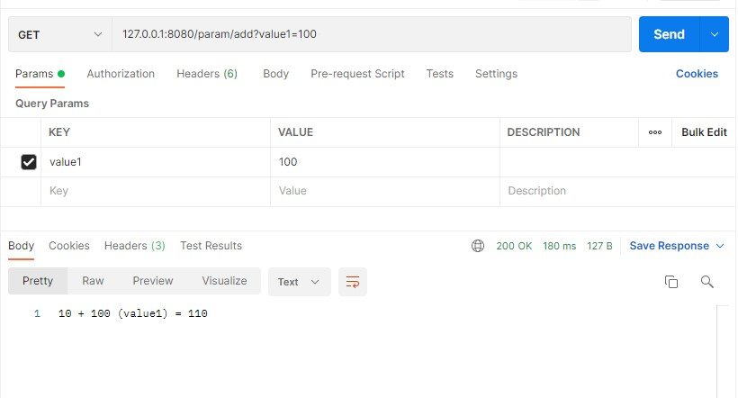
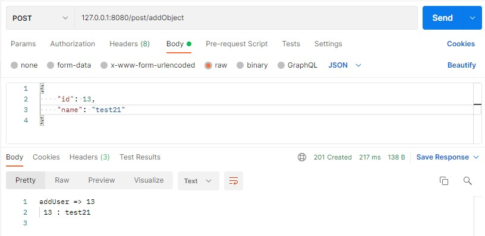
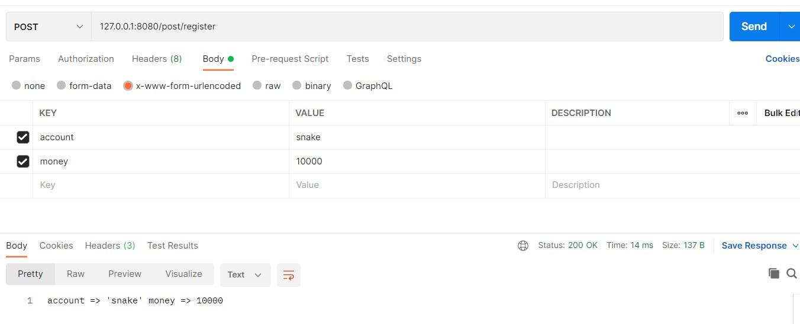

## 3. request
> 클라이언트 요청처리 방법을 알아본다.  

1. call.request 
   
    request 객체에는 
    - parameters 
    - queryParameters 
    - Headers 
    - Cookies 
    
    정보로 client의 요청을 처리할 수 있다.

----

path() 메소드나 uri를 통해서 요청한 경로를 처리할 수도 있다. Header에서 names() 메소드를 통해 해더에서 사용하는 필드명을 가져올 수 있으며, header[필드명] 형태로 값을 가져올 수 있다. 
   
~~~kotlin
private fun Routing.logRoute() {
    get("/") {
       val path    = call.request.uri
       val path2   = call.request.path()
       val resText = "uri=${path} path()=${path2} " 
       + "headers = ${call.request.headers.names()} " 
       + "headers[\"User-Agent\"]} = ${call.request.headers["User-Agent"]}"
       call.respondText(resText, contentType = ContentType.Text.Plain)
    }
}
~~~

postman 결과화면

경로명에 라우팅되는 파라메터들을 **call.parameters**를 통해 값을 가져올 수 있다. 
~~~kotlin
get("/user/{action}") {
    if (call.parameters["action"] == "add") {
        // ...
    }
}
~~~
그리고 get 방식의 요청에서 queryString의 값을 가져오고 싶다면 **call.request.queryParameters**를 통해서 값을 가져올 수 있다. 
~~~kotlin
private fun Routing.parameterRoute() {
    get("/param/{action}") {

        if(call.parameters["action"] == "add"){
           val value1  =  call.request.queryParameters["value1"]
           val sum     = 10  +   if ( value1 is String) value1.trim().toInt() else 0
           val resText = "10 + ${value1}(value1) = ${sum}"
           call.respondText(resText, contentType = ContentType.Text.Plain)
        }

    }
}

~~~

postman 결과화면

4. 고급 파라메터 처리 
   - Objects

post 방식으로 body에 json 형식의 데이터를 전송한다. 그리고 그 정보로 data class를 정의한 후, call.receive<데이터형>()으로 수신받는다.      
~~~kotlin
post("/post/addObject"){
    val addUser = call.receive<User>()
    userList.add(addUser)
    var info = ""
    userList.forEach { info += "${it.id} : ${it.name} \n" }
    call.respondText(
       "addUser => ${addUser.id} \n ${info}", 
       status = HttpStatusCode.Created)
}

   ...

val  userList : MutableList<User> = mutableListOf()
data class User(val id: Int, val name: String)

~~~

postman 결과화면

     

   - Form 

form 형식의 데이터를 처리하고자 한다면 call.receiveParameters()에서 객체를 받아온 후, []안에 필드명을 입력하여 사용가능하다.     
~~~kotlin
post("/post/register"){
   val formParam = call.receiveParameters()
   val account = formParam["account"].toString()
   val money   = formParam["money"].toString()

   call.respondText("account => '$account' money => ${money}")
}

~~~

postman 결과화면

   - Multipart 

멀티파트로 업로드시 파일데이터와 기타 필드를 처리하고자 한다면 call.receiveMultipart()로 MultiPartData 객체를 가져온 후,
forEachPart()를 통해 PartData 값을 비교분기하여 처리한다. PartData는 FormItem일 경우, 필드값이며 FileItem일 경우 파일데이터이다. 

~~~kotlin

post("/post/upload") {
    val multipartData = call.receiveMultipart()

    var fName = ""
    var nSize = 0
    multipartData.forEachPart { part ->
        when (part) {
            is PartData.FormItem -> {
                call.application.environment.log.info( "${part.name} = ${part.value}" )
            }
            is PartData.FileItem -> {
                fName = part.originalFileName as String

                var fileBytes = part.streamProvider().readBytes()
                File("$fName").writeBytes(fileBytes)
            }
        }
    }

    call.respondText(" 'uploads/$fName' ${nSize}")
}

~~~
