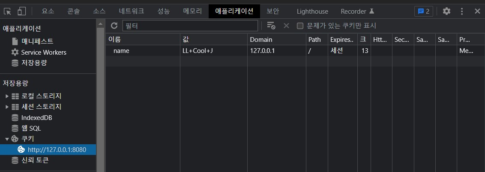

## 4. response
> 클라이언트 응답방법을 알아본다.  

응답하는 방법은 
- call.respondHtml()
- call.respondText()
- call.respond()

위의 3가지 메소드를 사용하는 방법이 일반적이다.

1. text 또는 html

단순히 문자열을 응답하는 방법으로는 call.respondText()을 사용한다.

~~~kotlin
call.respondText("hello world", contentType = ContentType.Text.Plain)
~~~   

그리고 간단한 HTML 출력은 call.respondHtml()을 호출하여 DSL(Domain-Specific Languages)로 작성된 HTML 스크립트로 값을 전달할 수 있다. 

~~~kotlin
// html dsl example
private fun Routing.dslRoute() {
    get("/html-dsl") {
        call.respondHtml {
            body {
                h1 { +"HTML" }
                ul {
                    for (n in 1..10) {
                        li { +"$n" }
                    }
                }
            }
        }
    }
}
~~~

2. object

json 형태의 클래스나 각종 템플릿(mustache, FreeMaker)을 변환하여 text로 응답하려면 call.respond()를 호출한다.   

~~~kotlin
// gson example
private fun Routing.gsonRoute() {
    get("/json/gson") {
        //call.respond(mapOf("hello" to "world"))

        call.respond(User(1, "test"))
    }
}

// mustache example
private fun Routing.mustacheRoute() {
    get("/html-mustache") {
        call.respond(MustacheContent("index.hbs", mapOf("user" to MustacheUser(1, "user1"))))
    }
}
~~~

3. file 
   
call.response.header()를 통해 해더를 설정 후, call.respondFile()을 통해 파일을 전송한다.   
~~~kotlin
fun Application.main() {
    routing {
        get("/download") {
            val file = File("files/ktor_logo.png")
            call.response.header(
                HttpHeaders.ContentDisposition,
                ContentDisposition.Attachment.withParameter(
                   ContentDisposition.Parameters.FileName, "ktor_logo.png")
                    .toString()
            )
            call.respondFile(file)
        }
    }
}
~~~

4. status
   
call.response.status()를 호출하며 HttpStatusCode 객체를 넘긴다.HttpStatusCode의 첫번째 파라메터는 HTTP code값이고 두번째는 설명이다. 
~~~kotlin
private fun Routing.statusHeaderRoute(){
    get("/status500"){
        call.response.status(HttpStatusCode(500, ""))
        call.respondText("<h1>500 error \uD83D\uDE16 </h1>", ContentType.Text.Html)
    }
}
~~~

5. header

header의 값을 설정하기 위해서는 
- call.response.header[]에 필드명과 값을 넣는 방법
- call.response.headers에 append() 메소드로 필드명과 값을 추가하는 방법

이 있다. 
~~~
get("/headers") {
    call.response.headers.append("Some field", "Some value")
}

...

get("/header") {
    call.response.header("Some field", "Some value")
}
~~~

6. cookies

call.response.cookies.append()를 통해 키와 값을 전달하여 추가할 수 있다. 
~~~kotlin
get("/cookies"){
    call.response.cookies.append("name", "LL Cool J")
    call.respondText("<h1>cookie is set </h1>", ContentType.Text.Html)
}
~~~

   
7. redirect

call.respondRedirect()를 호출하여 리다이렉션할 주소를 넘긴다. 
~~~kotlin

get("/redirect") {
    call.respondRedirect("https://www.google.com", permanent = true)
}

~~~
   
